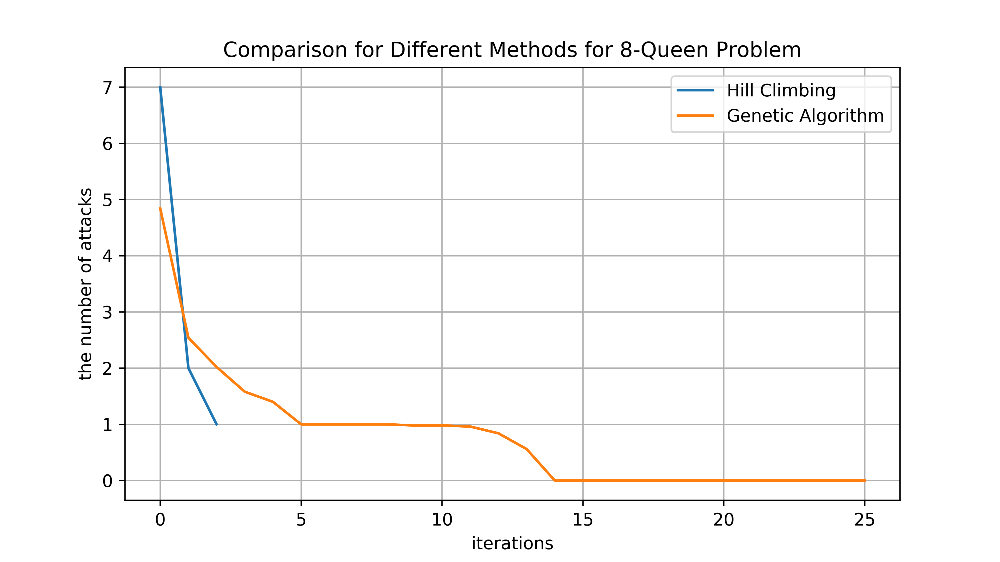
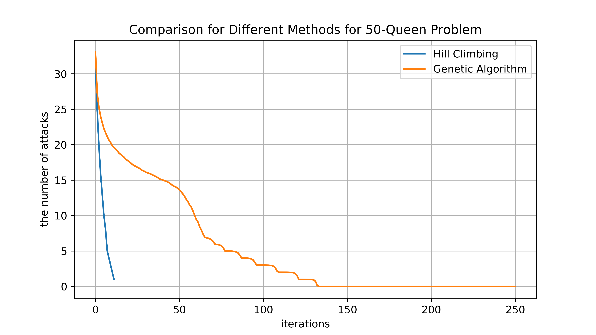
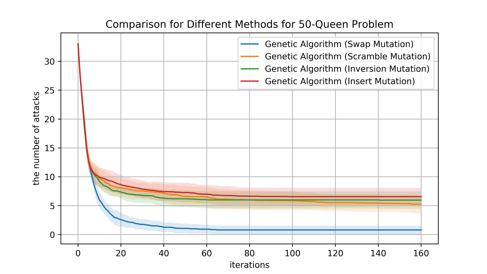
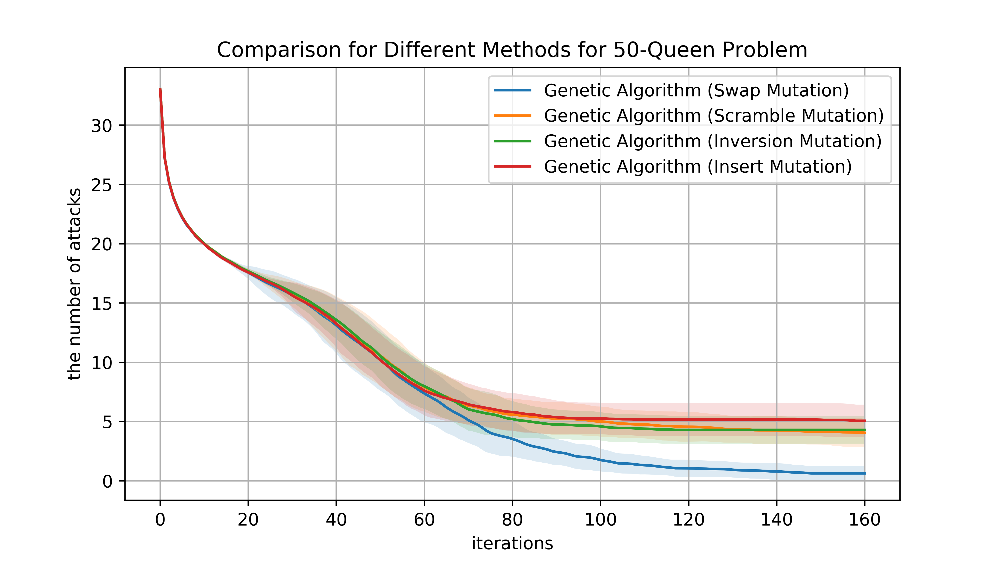

# Artificial Intelligence Homework - Then-Queen Problem
## Introduction
The N queens puzzle is the problem of placing eight chess queens on an N×N chessboard so that no two queens threaten each other. Thus, a solution requires that no two queens share the same row, column, or diagonal. The solutions exist for all natural numbers n with the exception of n=2 and n=3.

## Environment  
* python 3.6
* packages: matplotlib, numpy, random
* installation  
`pip install -r requirements.txt`
* executtion  
`python main.py`

## Report 
### 1. 8-queen problem (n = 8) 

(a) List all the results (average #attacks in the final configuration) from the two methods.  

|Methods         |the Final Number of Attacks|  
|----------------|---------------------------|
|Hill Climbing   |0.666| 
|Geneic Algorithm|0.166| 

(b) Compare the average running time for the three methods to get a solution.  

|Methods         |Average Runtime|  
|----------------|---------------------------|
|Hill Climbing   |6.64e-3 seconds| 
|Geneic Algorithm|0.119 seconds| 

(c) Compare the success rate (SR) of HC and GA.

|Methods         |Success Rate|  
|----------------|---------------------------|
|Hill Climbing   |0.3666| 
|Geneic Algorithm|0.8333| 

### 2. 50-queen problem (n = 50)

(a) List all the results (average #attacks in the final configuration) from the two methods. 

|Methods         |the Final Number of Attacks|  
|----------------|---------------------------|
|Hill Climbing   |0.86| 
|Geneic Algorithm|0.79| 

(b) Compare the average running time for the three methods to get a solution.  

|Methods         |Average Runtime|  
|----------------|---------------------------|
|Hill Climbing   |22.072 seconds| 
|Geneic Algorithm|217.569 seconds| 

(c) Compare the success rate (SR) of HC and GA.

|Methods         |Success Rate|  
|----------------|---------------------------|
|Hill Climbing   |0.39| 
|Geneic Algorithm|0.38| 

### 3. Methods
First, we formulate the problem formally.
#### Hill Climbing
* state: 
* successor:
* cost:

#### Genetic Algorithm
TS

FPS

## Source Code
* main.py
* problem.py
* environment.py
* ga.py
* HC.py
